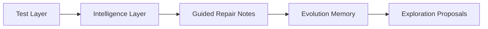

# AOK (Agent Operating Kernel)

AOK is a **prototype CLI for test failure capture, classification, and guided repair notes**. It runs a configured test command, stores structured failure reports, classifies likely failure types, and records suggestion files plus lightweight memory about repeated failures.

## Architecture

AOK currently operates in four practical phases:



1. **Reality (Test Layer)**: Executes a configured test command and stores structured failure captures.
2. **Intelligence**: Classifies failures via heuristics into UX, FUNCTIONAL, NETWORK, or UNKNOWN buckets.
3. **Guided Repair**: Writes suggestion files into `.aok/patches/` rather than mutating application source code.
4. **Memory and Exploration**: Tracks repeated failure patterns and records proposal-only exploration recommendations.

---

## Installation

AOK is still a prototype. Use it locally against disposable or review-heavy workflows first:

```bash
npm install -g aok
```

## Quick Start

Initialize AOK inside your target Node.js project:

```bash
# Sets up `.aok/`, config, and template files:
aok init

# Validates health and basic project structure:
aok doctor
```

---

## Configuration (`aok.config.cjs` or `aok.config.js`)

AOK generates a CommonJS config file at the project root during initialization:
- `aok.config.cjs` for projects with `"type": "module"`
- `aok.config.js` for CommonJS projects

During `aok init`, AOK now tries to detect a validation command from `package.json` scripts such as `test:e2e`, `e2e`, `test`, `check`, `verify`, `validate`, or `smoke`. If none is found, it leaves `testCommand` blank and `aok doctor` will report the project as not ready.

```javascript
module.exports = {
  testCommand: "npm run test:e2e",
  maxRepairAttempts: 4,
  enableExploration: false, // Prevents unintended structural rewrites
  strictUXMode: true,       // Favors UI safeguarding over AST manipulation
  memoryPath: ".aok/memory"
};
```

---

## Commands

AOK operates via a highly specialized CLI. 

### Diagnostics & Intelligence
- **`aok test:e2e`**: Runs the configured test command, captures failures, and executes the Intelligence Layer to formulate structured tasks.
- **`aok tasks`**: Prints the current queue of classified, structured repair tasks without executing them.
- **`aok doctor`**: Checks validation readiness, package health, configuration bindings, and whether AOK has a runnable truth command.

### Action & Evolution
- **`aok run`**: Runs tests, classifies failures, and writes guided repair notes.
- **`aok repair`**: Generates suggestion files from the existing `.aok/repair-tasks.json` queue without mutating source code.
- **`aok explore`**: Records proposal-only exploration recommendations for fragile files under `.aok/exploration/`.
- **`aok report`**: Prints summary information from the evolution memory store.

### Review Workflow
- **`aok patches`**: Lists generated repair and exploration proposals with status and priority metadata.
- **`aok proposal:status <id> <status>`**: Updates proposal workflow state (`pending`, `in_review`, `accepted`, `rejected`, `implemented`).

---

## Logs and Memory Tracking

AOK writes structured logs in `.aok/logs/` and stores failure captures in `.aok/e2e-failures.json`.
You can programmatically track command activity via:
- `runs.jsonl`
- `failures.jsonl`
- `fixes.jsonl`
- `explorations.jsonl`

AOK is intentionally conservative in this prototype stage: it records suggestions and history, but it does not claim autonomous source repair.

---

**Built as a review-first prototype.**
